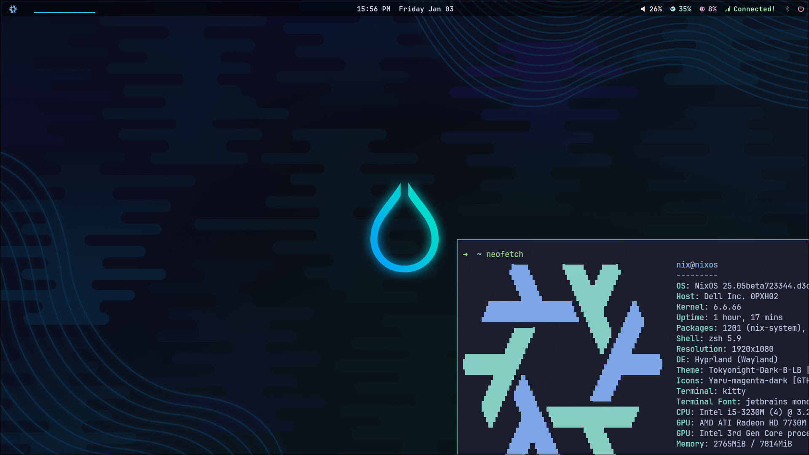

# hypnix

First hyprland baked iso-installable linux distro (or pseudo-distro), since this is 100% nixos but with a different default config!

> open alpha, [download here](https://drive.google.com/drive/folders/1HDrhGZFeXwFT8lUaF6di-TJMUIaO02Bo)!

# shortcuts

| key combination | effect |
|---|---|
| `SUPER` | open launcher (rofi) |
| `SUPER` + `ENTER` | open terminal (kitty) |
| `SUPER` + `<arrow key>` | shift focus to window on the left, right, up or down |
| `SUPER` + `ALT` + `<arrow key>` | move window to the left, right, up or down |
| `SUPER` + `<number>` | move to workspace number (numbered from 0 to 10) |
| `SUPER` + `SHIFT` + `<number>` | move window to workspace number (numbered from 0 to 10) and switch to that workspace |
| `SUPER` + `F` | floating mode - window can be placed anywhere |
| `SUPER` + `B` | toggle visibiliy of top bar (waybar) |
| `SUPER` + `<left mouse button while moving mouse>` | move window with mouse |
| `SUPER` + `<right mouse button while moving mouse>` | resize window with mouse |
| `SUPER` + `CRTL` + `<arrow key>` | resize window with keyboard |
| `SUPER` + `TAB` | rotate between windows (only applicable in certain contexts, e.g. fullscreen or floating mode) |
| `SUPER` + `+` | fullscreen |
| `SUPER` + `ALT` + `+` | fakefullscreen (using this a monicle-layout along with `SUPER` + `TAB` to rotate between windows in a workspace) |

# how to change anything

To install packages, change system configuration or anything similar, the procedure is always to edit some config file followed by a rebuild:
- `cd /etc/nixos && sudo -E su` 
  Note: `-E` to inherit access to the wayland session, e.g. to be even able to copy things from the browser (running as non-root) to the text editor (running as root).
- Edit files in this directory (see [overview](config/hypnix/readme.md)), e.g.
  - `nano packages.nix` (more beginner friendly)
  - `v packages.nix` (vi alias: v)
- `nixos-rebuild switch --impure` 
  (--impure only required when this dir is in git)

> If you messed up your config so that you cannot boot anymore, reboot and select an older revision in the boot loader. This is a basic nixos-feature.

# roadmap

TODO

# developer information

Check [dev.md](dev.md).

# tribute

Much stuff came from https://github.com/HeinzDev/Hyprland-dotfiles and of course there are too many projects involved here to thank everyone!
