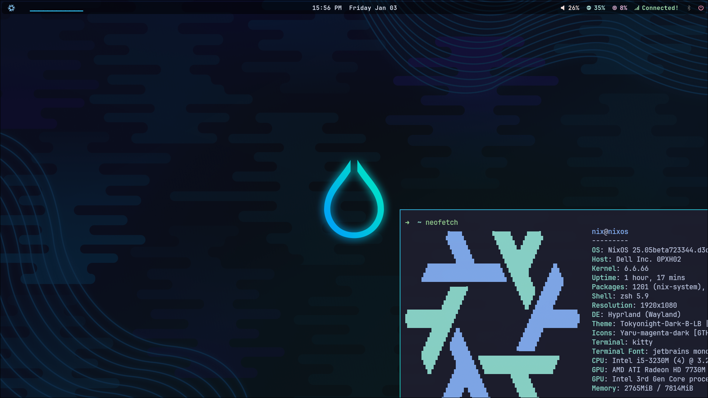

# hypnix

First hyprland baked iso-installable linux distro (or pseudo-distro), since this is 100% nixos but with a different default config!

A key feature of hypnix is the option of using an android device to handle operating-system level authentication, which means **"no more password typing"** - see [pills / guides](#pills--guides).

Further, it comes with Hyprland, a dynamic tiling window manager with the goal of **not wasting screen space per default**, and a default configuration that is optimized for **keyboard shortcuts**, rather than mouse interaction.

> open alpha, [download here](https://drive.google.com/drive/folders/1HDrhGZFeXwFT8lUaF6di-TJMUIaO02Bo)!

# shortcuts

| key combination | effect |
|---|---|
| `SUPER` | open launcher (rofi) |
| `SUPER` + `ENTER` | open terminal (kitty) |
| `SUPER` + `<arrow key>` | shift focus to window on the left, right, up or down |
| `SUPER` + `ALT` + `<arrow key>` | move window to the left, right, up or down |
| `SUPER` + `<number>` | move to workspace number (numbered from 0 to 10) |
| `SUPER` + `SHIFT` + `<number>` | move window to workspace number (numbered from 0 to 10) and switch to that workspace |
| `SUPER` + `F` | floating mode - window can be placed anywhere |
| `SUPER` + `B` | toggle visibiliy of top bar (waybar) |
| `SUPER` + `<left mouse button while moving mouse>` | move window with mouse |
| `SUPER` + `<right mouse button while moving mouse>` | resize window with mouse |
| `SUPER` + `CRTL` + `<arrow key>` | resize window with keyboard |
| `SUPER` + `TAB` | rotate between windows (only applicable in certain contexts, e.g. fullscreen or floating mode) |
| `SUPER` + `+` | fullscreen |
| `SUPER` + `ALT` + `+` | fakefullscreen (using this as monicle-layout along with `SUPER` + `TAB` to rotate between windows in a workspace) |
| `SUPER` + `SHIFT`+ `<arrow key>` | terminal (kitty): scroll up/down |
| `SUPER` + `SHIFT` + `h` | terminal (kitty): output string search - type `?` for search from bottom to top, followed by the search term and `ENTER` |
| `PRINT` | drag to select a region → copies screenshot to clipboard (`grim -g "$(slurp)" - \| wl-copy`) |
| `SHIFT` + `PRINT` | drag to select a region → saves screenshot to file via `grim` |

For a full-screen screenshot there is no dedicated keybind, if you need this frequently, you could alter the config above to run `grim` without args instead or add an additional shortcut that.

# how to change anything

To install packages, change system configuration or anything similar, the procedure is always to edit some config file followed by a rebuild:
- `cd /etc/nixos && sudo -E su` 
  Note: `-E` to inherit access to the wayland session, e.g. to be even able to copy things from the browser (running as non-root) to the text editor (running as root).
- Edit files in this directory (see [overview](config/hypnix/readme.md)), e.g.
  - `nano packages.nix` (more beginner friendly)
  - `v packages.nix` (vi alias: v)
- `nix-channel --update` 
  Optional - only required if you want to update to the latest versions (all packages of the channel!)
- `nixos-rebuild switch --impure` 
  (--impure only required when this dir is in git)

> If you messed up your config so that you cannot boot anymore, reboot and select an older revision in the boot loader. This is a basic nixos-feature.

# pills / guides

- [sudo/login via android](pills/1-android-linux-pam.md)
- [disk decryption via android](pills/2-clevis-luks-decryption.md)

# drawbacks

- Not extremely beginner friendly (especially when doing a lot of customizations), linux knowledge helpful, however, with the help of AI even a beginner could come extremely far these days.
- Based on NixOS and therefore inheriting all strenghts and weaknesses thereof. Example: If your nixos build/config is broken and you want to repair stuff manually, you cannot ust edit a random file, download random software from third party places etc. Everything needs to go through the nixos build and you need to focus on getting that running cleanly again, which is oftentimes hard work and may require altering .nix source files etc. However, I see the benefits outweigh and have familiarized myself with the NixOS ecosystem enough that I could live on that platform since about three years without plans of swiching. 

# developer information

Check [dev.md](dev.md).

# tribute

Much stuff came from https://github.com/HeinzDev/Hyprland-dotfiles and of course there are too many projects involved here to thank everyone!
